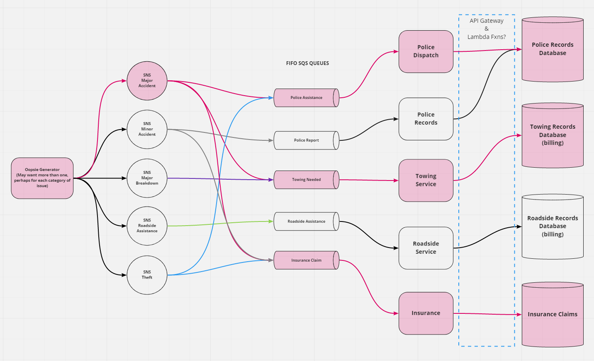

# Oopsie
---

## Overview

A back-end application simulating communication between a driver in distress and different entities of roadside assistance, such as police report, towing service or a service like AAA. The app will utilize several elements of Amazon Web Services including, SNS, SQS, API Gateway, Lambda functions and DynamoDB.

## Authors
- Nick Abramowicz
- Nick Magruder
- Seid Mohamed
- William Moreno

## UML

Initial UML

## Resources
- SNS Messaging Lambda Adapted from Sean Bradley's AWS SMS Demo on YouTube and [Github](https://github.com/Sean-Bradley/AWS-SNS-SMS-with-NodeJS)
- Adapted rom AWS SNS examples: https://docs.aws.amazon.com/sdk-for-javascript/v2/developer-guide/sns-examples-sending-sms.html
