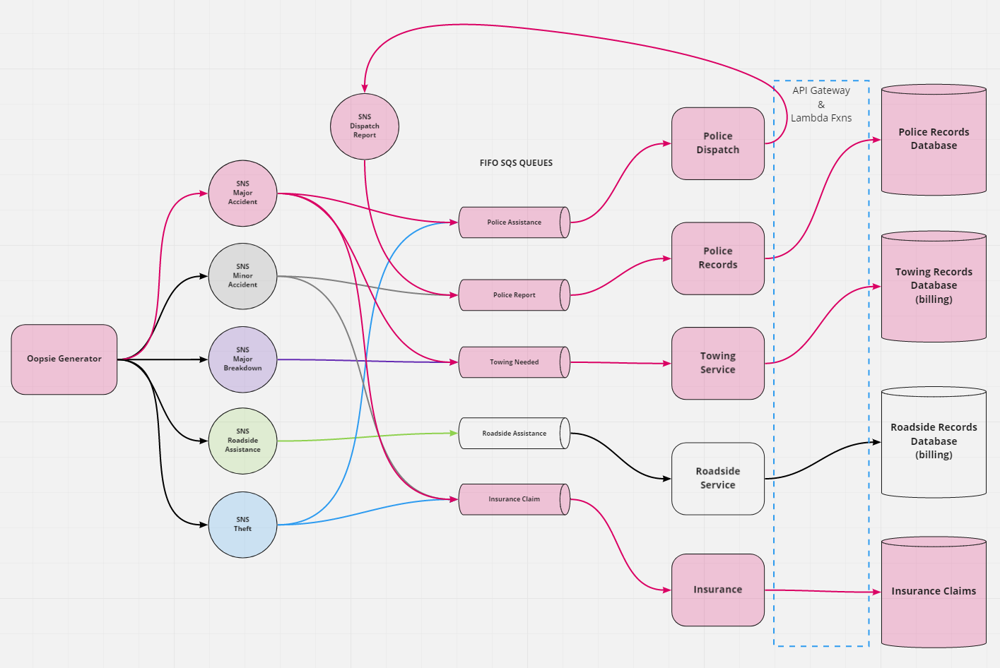

# Oopsie
Version 1.0.0

## Overview

- Summary: 
A back-end application simulating communication between a driver in distress and different entities of roadside assistance, such as police report, towing service or a service like AAA. The app will utilize several elements of Amazon Web Services including, SNS, SQS, API Gateway, Lambda functions and DynamoDB.
- What problem or pain point does it solve? 
    - Our application helps drivers with situations that need to be solved by the services that we provide. Stream lines the dispatch of road side assistance to drivers in need.
- Minimum Viable Product (MVP) definition.
    - An application that generates simulated situations through AWS and communicates to responders and drivers. Responders will store records in database using an API Gateway and Lambda functions.

- In addition, the app sends emails and SMS messages to users using AWS SNS, SMS and SES.

## Authors
- Nick Abramowicz
- Nick Magruder
- Seid Mohamed
- William Moreno

## UML Diagram
Conceptual UML Diagram

## Resources
- SNS Messaging Lambda Adapted from Sean Bradley's AWS SMS Demo on YouTube and [Github](https://github.com/Sean-Bradley/AWS-SNS-SMS-with-NodeJS)
- [AWS SNS Tutorial/Examples](https://docs.aws.amazon.com/sdk-for-javascript/v2/developer-guide/sns-examples-sending-sms.html)

